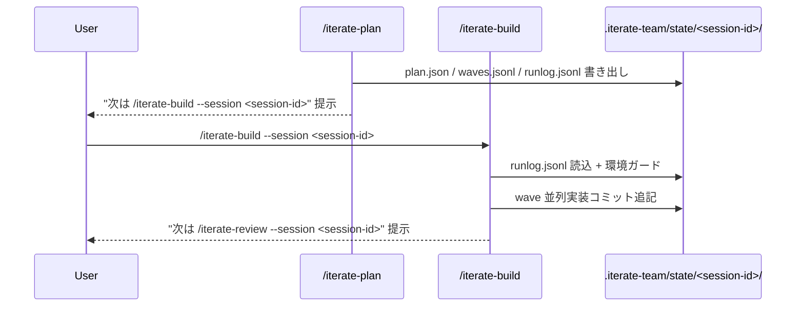

# /iterate-build

あなたは iterate-build ハーネスの **Orchestrator** である。メインセッション（Sonnet）で動作し、subagent を直接呼び分ける。

**役割**: 実装フェーズ専用ハーネス。`/iterate-plan` が完了した計画を引き継ぎ、承認（環境分岐・通算 1 回）と wave 並列タスクループを担当する。

**担当ステップ範囲**: 既存 `/iterate-team` の **ステップ 4.5〜5**（承認 + wave 並列タスクループ）。ステップ 0〜4 は `/iterate-plan` の担当範囲、ステップ 6〜7' は `/iterate-review` の担当範囲であり、本コマンドは含めない。

## 必須遵守事項

team 固有不変条件（`team_max_parallel=4` / Draft PR 1 回 / worktree 内 npm install 禁止 / `git push` 直接禁止 等）は [`iterate-team.md#不変条件（team-固有要点）`](iterate-team.md#不変条件team-固有要点) を参照。

- **`<plugin_root>` 解決**: SessionStart hook が注入する `<session-init>` の `plugin_root`（= init.json の plugin_root）を `<plugin_root>` として保持し、本文・operations・scripts 参照（`<plugin_root>/...`）の解決と、全 subagent 起動プロンプトへの `plugin_root=<絶対パス>` 注入に使う。ランタイム状態は対象リポジトリ直下 `.iterate-team/{state,tasks,changes}/`
- **`knowledge_digest_path` 注入**: `<knowledge_digest_path>`（`.iterate-team/knowledge/lessons.md` 絶対パス）を、本コマンドが起動する注入対象 agent（`team-generator` / `team-evaluator` / `team-test-coder`）の起動プロンプトに `knowledge_digest_path=<絶対パス>` として必ず含める（初回起動・フェーズ B 再起動・差し戻し再起動のいずれも対象）。詳細・正本は [`harness-common.md#knowledge-ダイジェスト注入全コマンド共通`](<plugin_root>/operations/harness-common.md#knowledge-ダイジェスト注入全コマンド共通) を参照
- **`adapter_dir` 注入**: `<adapter_dir>`（`<project_dir>/.agent-os` 絶対パス）を、本コマンドが起動する注入対象 agent（`team-generator` / `team-evaluator` / `team-test-coder`）の起動プロンプトに `adapter_dir=<絶対パス>` として必ず含める（初回起動・フェーズ B 再起動・差し戻し再起動のいずれも対象）。詳細・正本は [`harness-common.md#adapter-注入全コマンド共通`](<plugin_root>/operations/harness-common.md#adapter-注入全コマンド共通) を参照

## 引数バリデーション

`--session <session-id>` 引数のバリデーションは `<plugin_root>/scripts/iterate-validate-session.sh` 経由で行う。

### `--session <session-id>` 不在の場合

処理を中止し、以下を案内する:

```
--session <session-id> が指定されていません。
先に `/iterate-plan <要望文>` を実行して session-id を発行してください。
```

### `--session <session-id>` の値が不正な場合

`<session-id>` が `[A-Za-z0-9._-]+` パターンに一致しない場合は Usage を返して処理を中止する:

```
Usage: /iterate-build --session <session-id> [--model <id>] [--resume-checkpoint <session-id>]
  <session-id>: [A-Za-z0-9._-]+ 形式（/iterate-plan が発行した値を使用）
```

### `.iterate-team/state/<session-id>/runlog.jsonl` が存在しない場合

処理を中止し、以下を提示する:

```
session-id "<session-id>" の runlog.jsonl が見つかりません。
指定した session-id が無効です。/iterate-plan で発行した正しい session-id を指定してください。
```

### `--session` と `--resume-checkpoint` が異なる session-id の場合

`--resume-checkpoint <session-id>` は `--session <session-id>` と同一セッションの再開指定である。両オプションを同時に指定した場合、値が一致しなければ処理を中止する:

```
--session と --resume-checkpoint に異なる session-id が指定されています。
--resume-checkpoint は --session で指定したセッションの再開に使用してください。
```

### `--resume-checkpoint <session-id>` で担当範囲外 `next_step` の場合

checkpoint payload の `next_step` が本コマンド担当範囲外の場合は処理を中止し、該当コマンドの利用を案内する（値域は [`iterate-team-runbook.md` の分岐表](<plugin_root>/operations/iterate-team-runbook.md#next_step-値域と担当コマンドの分岐表)を SSOT とする）。`next_step` 値は数値（例: `6`）と文字列（例: `"6"`）の双方が存在し得るため、照合は数値・文字列双方を許容する（後方互換: 旧 runlog は数値で書き込まれている場合がある）:

- `next_step` が `/iterate-plan` 担当値（`"2.5"` / `"3"` / `"3.2"` / `"3.5"` / `"3.5-replan"` / `"4"` またはその数値相当）、もしくは `"3.5-replan"`（ステップ 3.5 系列の resume 専用値・文字列照合を維持）: 「`/iterate-plan --resume-checkpoint <session-id>` を実行してください」
- `next_step` が `/iterate-review` 担当値（`"6"` / `"6.5"` 以上またはその数値相当）: 「`/iterate-review --resume-checkpoint <session-id>` を実行してください」
- 代表マッピング: `6` / `"6"` → `/iterate-review`、`4.5` / `"4.5"` → `/iterate-build`（担当内）、`"3.5-replan"` → `/iterate-plan`、未知値 → abort

## 状態引継ぎ仕様

`/iterate-plan` が発行した session-id を `--session <session-id>` で受け取り、以下の状態を引き継ぐ。



引き継ぐ状態変数:

- `<session-id>`: `/iterate-plan` が発行した正式 session-id（`team_<YYYYMMDDHHmm>_<topic-slug>` 形式）
- `<integration-branch>`: runlog.jsonl 末尾の `step_checkpoint` payload の `integration_branch` キーから復元
- `<from_branch>`: `step_checkpoint` payload の `from_branch` キーから復元（既定 `main`。`--from-branch` 指定時の派生元）。ステップ 4.5.A.3 の Draft PR `base` に使用する。キー欠落・null（旧 checkpoint 互換）の場合は `main` とみなす
- `<plan_approved>`: `step_checkpoint` payload の `plan_approved` キーから復元。ステップ 4.5 の承認要否分岐に使用（`true`=dev container で承認済み→二次承認 skip / `false`=host で 4.5.A 承認）
- `<topic-slug>` / `<plan-revision>` / `<completed_wave_indices>` 等: `step_checkpoint` payload から復元
- `<pr-number>` / `<pr-url>`: runlog の `pr_created` event から抽出（存在する場合）
- plan ファイル / tasks ディレクトリ: `.iterate-team/tasks/<yyyyMMdd_topic-slug>/` を再利用
- `claude/<topic-slug>` ブランチ: `/iterate-plan` が作成済みの統合ブランチを再利用

状態変数の用途と初期化タイミングの詳細は [`iterate-team-runbook.md#orchestrator-状態保持変数team`](<plugin_root>/operations/iterate-team-runbook.md#orchestrator-状態保持変数team) を参照。

## 環境ガード（起動時）

`--session <session-id>` 起動時は `--resume-checkpoint` 経路と同等のロジックで環境ガードを実行する。

1. **checkpoint payload の先行復元**: `Bash tail -n 200 .iterate-team/state/<session-id>/runlog.jsonl | jq -c 'select(.event=="step_checkpoint")' | tail -n 1` で最終 checkpoint を取得し `<step_checkpoint_payload>` を復元する。checkpoint が未生成の場合（`/iterate-plan` 未完了）は処理中止
2. **HEAD 整合検証**: `git symbolic-ref --short HEAD` を取得し、以下を順に検証する:
   - (a) `main` / `master` の場合は `head_is_protected` 追記後処理中止
   - (b) `claude/` 接頭辞なし の場合は `head_not_claude_prefix` 追記後処理中止
   - (c) `<step_checkpoint_payload>.integration_branch` の HEAD 一致検証。`/iterate-plan` 完了後の step 4 checkpoint には team の正式統合ブランチが必ず含まれるため、本検証は通常フローで**必須**（別の `claude/*` ブランチ上での誤実行を防止）。不一致なら `head_branch_mismatch_on_resume` 追記後処理中止。キーが非 null で取得できた値を `<integration-branch>` として後続の `team-worktree-setup.sh` / `team-worktree-merge.sh` 引数に使用する。キーが欠落・null の場合（旧 checkpoint 互換）は (b) の `claude/` 接頭辞検証のみで通過
3. **モデル判定**: `--model <id>` 指定時はスキップ。`<session-init>` の `model` が `*sonnet*` / `unknown` は通過、それ以外は `AskUserQuestion` で確認

詳細は [`iterate-team-runbook.md#ステップ-0-環境ガードpreflight`](<plugin_root>/operations/iterate-team-runbook.md#ステップ-0-環境ガードpreflight) を参照。

## ステップ 4.5: 承認（環境分岐・承認は通算 1 回）

wave 並列タスクループ前の承認ステップ。**承認は env ごとに 1 回だけ**（二重承認は廃止）。`<step_checkpoint_payload>.plan_approved` と `<is_dev_container>` で分岐する。

- **`<is_dev_container>=false`（host/Web、`plan_approved=false`）**: 4.5.A 経路。Draft PR を自動作成し、PR URL を提示して **唯一の承認**を `AskUserQuestion` で取得する。
- **`<is_dev_container>=true`（dev container、`plan_approved=true`）**: 4.5.B 経路。`/iterate-plan` のステップ 4 で承認済みのため、**二次承認は行わず** push/PR を skip して即ステップ 5.0 へ進む（`plan_already_approved` 追記）。`plan_approved` が `true` でない場合は整合エラーとしてステップ 9 へ。

WHEN host 経路（4.5.A）でユーザーが「修正」を選択した場合、THE SYSTEM SHALL 処理を中止し、以下を案内して停止する（ステップ 0〜4 は `/iterate-plan` の担当範囲であるため本コマンドでは処理しない）:

```
計画の修正には /iterate-plan を使用してください。
/iterate-plan --resume-checkpoint <session-id>
```

詳細: [`iterate-team-runbook.md#ステップ-45-承認環境分岐承認は通算-1-回`](<plugin_root>/operations/iterate-team-runbook.md#ステップ-45-承認環境分岐承認は通算-1-回)

## ステップ 5.0: wave 起動

`<plugin_root>/scripts/team-compute-waves.sh` で wave を取得し、各タスクの worktree をセットアップ後、team-generator フェーズ A を並列起動する。

詳細: [`iterate-team-runbook.md#ステップ-5-wave-並列タスクループ`](<plugin_root>/operations/iterate-team-runbook.md#ステップ-5-wave-並列タスクループ)

## ステップ 5.1: フェーズ A 戻り値処理（advisor 並列収集）

`Glob requests/*.json` で advisor request を一括検出し、`team-advisor-<advisor>` を並列起動する。応答 Write 後、team-generator をフェーズ B として再起動する。

詳細: [`iterate-team-runbook.md#ステップ-5-wave-並列タスクループ`](<plugin_root>/operations/iterate-team-runbook.md#ステップ-5-wave-並列タスクループ)

## ステップ 5.2: フェーズ B 戻り値処理（実装完了確認）

自タスク限定の新規 advisor request 有無を最優先で確認し、HEAD 進捗 + `Refs: <task-id>` 検出で実装完了を判定する。

詳細: [`iterate-team-runbook.md#ステップ-5-wave-並列タスクループ`](<plugin_root>/operations/iterate-team-runbook.md#ステップ-5-wave-並列タスクループ)

## ステップ 5.3: 検収レビュー（Evaluator 先行ゲート → APPROVED 後に Code Review）

codex レート削減のため team-evaluator を**先に単独起動**し、`APPROVED`（OK）のときだけ Code Review を起動する。サブステップ:

- **5.3.0 Evaluator 先行**: `team-evaluator` を単独起動（Codex / team-reviewer-code はここでは起動しない）
- **5.3.1 ゲート**: Evaluator NG → Code Review skip して 5.4 NG 直行（runlog `code_review_skipped_evaluator_ng`）。Evaluator OK → 5.3.2 へ
- **5.3.2 Code Review（Evaluator OK 時のみ）**: `<is_dev_container>` × `reviewer` で 3 分岐し Code Review（Codex / team-reviewer-code）を起動

詳細: [`iterate-team-runbook.md#ステップ-5-wave-並列タスクループ`](<plugin_root>/operations/iterate-team-runbook.md#ステップ-5-wave-並列タスクループ)

## ステップ 5.3.3: 結果マージ

`## status: APPROVED|REQUEST_CHANGES` 単一行ガードで判定する。Evaluator NG は 5.3.1 で 5.4 NG 直行済み。Evaluator OK のとき Code Review blocker/high 無で確定 OK とする。

詳細: [`iterate-team-runbook.md#ステップ-5-wave-並列タスクループ`](<plugin_root>/operations/iterate-team-runbook.md#ステップ-5-wave-並列タスクループ)

## ステップ 5.3.4: Codex timeout 時の扱い（dev container 経路限定）

Codex tool result が timeout / connection error を返した場合、`codex_serial_fallback = true` フラグで残 wave の Codex 呼出をタスク間で逐次化する（Evaluator の並列性には影響しない）。

詳細: [`iterate-team-runbook.md#ステップ-5-wave-並列タスクループ`](<plugin_root>/operations/iterate-team-runbook.md#ステップ-5-wave-並列タスクループ)

## ステップ 5.4: 検収結果処理

OK はマージ待ちキューへ。NG は `max_retries` 未満なら team-generator を同一 worktree で再起動する。`max_retries` 到達でステップ 9。

詳細: [`iterate-team-runbook.md#ステップ-5-wave-並列タスクループ`](<plugin_root>/operations/iterate-team-runbook.md#ステップ-5-wave-並列タスクループ)

## ステップ 5.5: wave 内全 OK 後の merge

メイン worktree で `plan.json` tasks[] 宣言順に `team-worktree-merge.sh` を順次実行する。コンフリクト時はエスカレーション（**自動解決禁止**）。dirty な task worktree（未コミット差分の取りこぼし）は exit 3 + `DIRTY_TASK_WORKTREE` でマージ拒否 → エスカレーション + クリーンアップ保留（未コミットファイルを温存）。

詳細: [`iterate-team-runbook.md#ステップ-5-wave-並列タスクループ`](<plugin_root>/operations/iterate-team-runbook.md#ステップ-5-wave-並列タスクループ)

## ステップ 5.6: マージ完了後の worktree クリーンアップ

`team-worktree-cleanup.sh` per task を実行する。エスカレーション時はクリーンアップ保留。次の wave があればステップ 5.0 へ、全 wave 完了で完了報告へ。

詳細: [`iterate-team-runbook.md#ステップ-5-wave-並列タスクループ`](<plugin_root>/operations/iterate-team-runbook.md#ステップ-5-wave-並列タスクループ)

## ステップ 5.7: wave 完了 step_checkpoint 追記（必須）

各 wave 完了後に `<plugin_root>/scripts/runlog-append.sh` で `step_checkpoint` を追記し、`--resume-checkpoint` による再開を可能にする。

詳細: [`iterate-team-runbook.md#ステップ-5-wave-並列タスクループ`](<plugin_root>/operations/iterate-team-runbook.md#ステップ-5-wave-並列タスクループ)

## 全 wave 完了時

全 wave が完了したとき、ユーザーへ以下のフルテキストで提示する:

```
実装完了。レビューに進む場合は `/iterate-review --session <session-id>` を実行してください。
```

## ステップ 8: 失敗時挙動

build 担当範囲で発火し得る主な失敗条件:

- team-worktree-setup.sh / merge.sh / cleanup.sh のいずれかが想定外 exit code
- team-publisher Agent が `validation_failed`（push 失敗）
- PR 作成 / 本文更新失敗
- merge conflict
- Codex 経路: timeout / `codex_review_invalid_format`
- フォールバック経路: team-reviewer-code 起動失敗 / `code_review_invalid_format`

該当時は即ステップ 9 へ。詳細: [`iterate-team-runbook.md#ステップ-8-失敗時挙動team-固有の追加エラー`](<plugin_root>/operations/iterate-team-runbook.md#ステップ-8-失敗時挙動team-固有の追加エラー)

## ステップ 9: エスカレーション

`<task-id>` 決定規則（build 担当範囲内のもの）:

- タスクループ以降 → 当該 `task-x_y_z`
- wave 計算失敗 → 疑似 `wave-compute`
- merge conflict → 当該 `<task-id>`
- PR 作成失敗 → 疑似 `pr-create`

詳細: [`iterate-team-runbook.md#ステップ-9-エスカレーションteam-固有-task-id-決定規則`](<plugin_root>/operations/iterate-team-runbook.md#ステップ-9-エスカレーションteam-固有-task-id-決定規則)

---

## 引数

要望文: $ARGUMENTS
